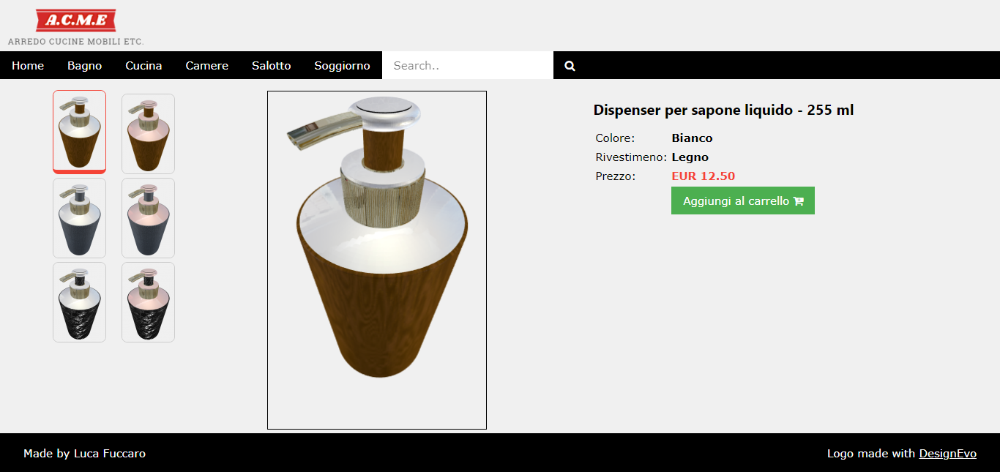

# ProductVisualization - Fuccaro

##  Esecuzione

Per una corretta visualizzazione è necessario l'utilizzo di un web server, per esempio Xampp. Per ulteriori informazioni consultare la documentazione Threejs alla pagina [How to run things locally](https://threejs.org/docs/#manual/introduction/How-to-run-things-locally).

## Introduzione

Per il segunte progetto si è realizzato un configuratore di prodotto all'interno di un sito web di e-commerce.

### Modello

Come modello è stato scelto un dispenser per sapone liquido, reperibile gratuitamente dal sito [Free3D](https://free3d.com) con licenza **Non-commercial use License**.
Per l'utilizzo è stata apportata una piccola modifica, avaalendosi sel software gratuiro [Blender](https://www.blender.org/), per rimuovere la presenza di un piano sotto al modello.

## Shaders

Al modello caricato non sono state applicate le sue textures predefinite, sono stati invece creati appositi materiali per un miglior realismo.

### Materiale metallico

Un materiale mettallico è stato realizzato attraverso l'uso di uno Shader per implementare l'effetto di riflessione. Per tale scopo è stata utilizzata una enviroment map rappresentate l'interno di un bagno domestico.

### Materiale lucido

Per il materiale lucido è stato combinato il BRDF material con luce speculare e diffusiva con l'effetto di riflessione della luce ambientale data dalla cubemap utilizzata anche per il materiale metallico. Sono state utilizzate anche texture, per la rappresentazione dei colori diffusivi e speculare (diffuse/specular map), ruvidità del materiale (roughness map) e normal map.

### Texture

Per il rivestimento, sono state utilizzate delle texture per tre materiali diversi: uno in legno, uno in denim (o tessuto di jeans) e un altro in finta pelle di coccodrillo di colore nero.
In questo caso, per lo shader non è stato neccessario l'uso dell'enviroment map, essendo che nessuno dei materiali possiede una caratteristica rifflettente.
Le texture sono state scaricate dal sito [Substance Share](https://share.allegorithmic.com/).

### Luci (posizionamento e attenuazione)

Oltre alla enviroment map sono state utilizzate anche quattro diverse luci, posizionate in modo da illuminare nel modo corretto l'oggetto nella scena. Una luce e stata posizionata sopra l'oggetto, due lateralmente e l'ultima sotto l'oggetto. Per ogni luce si è deciso di implementare un effetto di _attenuazione_ a seconda della distanza dall'oggetto.

## Pagina web

Per la realizzazione della pagina web è stato utilizzato il framework gratuito [W3.CSS](https://www.w3schools.com/w3css/).

## Credits

Logo made with <a href="https://www.designevo.com/en/" target="_blank" title="Free Online Logo Maker">DesignEvo</a>
  
